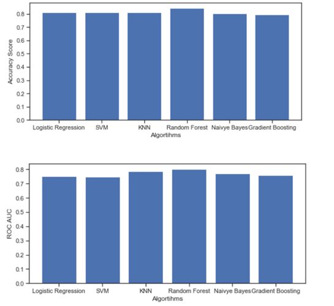

## Diabetes Prediction using ML Algorithms

These are the algorithms used:
1. Support Vector Machine (SVM)
2. K-Nearest Neighbor (KNN)
3. Logistic Regression
4. Random Forest
5. Naive Bayes
6. Gradient Boosting

* Highest accuracy achieved: 84.375%
* Highest ROC achieved: 80.12%
* By using Algorithm: Random Forest.

## Results

